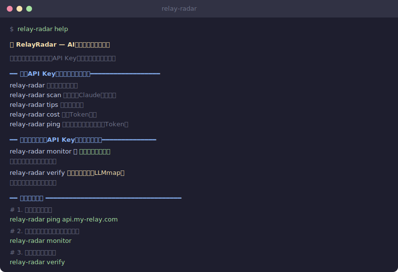
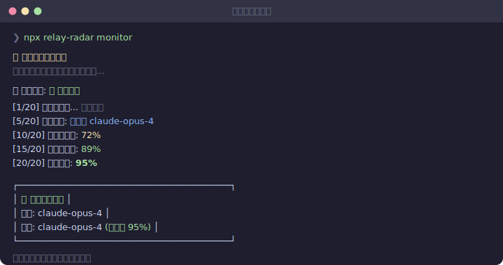

<p align="center">
  <h1 align="center">🛰️ RelayRadar</h1>
  <p align="center"><b>你的中转站，用的是真模型吗？</b></p>
  <p align="center">
    
    
    
  </p>
</p>

<p align="center">
  
</p>

## 一句话

帮你检测 Claude Code 中转站是否偷偷换了模型、多收了钱。

**不需要注册，不需要上传，不收集任何数据。** 装好 Node.js，一行命令就能用。

## 30秒上手

```bash
# 看看你花了多少钱（扫描本地日志，不联网）
npx relay-radar scan

# 省钱技巧
npx relay-radar tips

# 算一笔账：10万输入 + 5万输出，Opus 要多少钱？
npx relay-radar cost claude-opus-4 100000 50000
```

以上命令**不需要API Key**，直接复制粘贴就能跑。

## 检测你的中转站

```bash
# 1. 先测一下能不能连上（免费，不消耗Token）
npx relay-radar ping api.你的中转站.com

# 2. 设置你的Key（只存在内存里，不写文件）
export RELAY_KEY="sk-..."
npx relay-radar init

# 3. 检测模型是不是真的（推荐，中转站检测不到你在验证）
npx relay-radar monitor
```

<p align="center">
  
</p>

## 它能发现什么问题？

| 你遇到的问题 | RelayRadar 怎么检测 |
|---|---|
| 买的Opus，给的是Sonnet | 分析响应的行为特征，不同模型"写作风格"不同 |
| 中转站偷偷注入System Prompt多收钱 | 发个"Hi"，看input tokens是不是异常高 |
| 有时快有时慢，怀疑随机降级 | 持续监控，统计学方法检测行为漂移 |
| 不知道哪家中转站靠谱 | 五维评分排名，数据公开透明 |

## 所有命令

| 命令 | 做什么 | 要Key吗 |
|------|--------|:-------:|
| `scan` | 扫描本地Claude日志，看花了多少 | 不要 |
| `tips` | 省钱技巧 | 不要 |
| `cost` | 算Token多少钱 | 不要 |
| `ping` | 测中转站能不能连上 | 不要 |
| `monitor` ⭐ | 检测模型是不是真的（推荐） | 要 |
| `verify` | 快速检测（几分钟出结果） | 要 |
| `probe` | 测延迟 | 要 |
| `rank` | 综合排名 | 要 |

> 所有需要Key的命令，执行前会告诉你大概花多少钱，你确认了才跑。

## 排名网站

**👉 [在线查看中转站排名](https://aethercore-dev.github.io/relay-radar/)**

我们自己掏钱买各家中转站服务来测试，按5个维度打分：

- 🔬 **模型真不真**（权重最高 30%）— 用的真是你买的模型吗？
- 💰 **收费准不准**（25%）— 有没有多算Token？
- 🛡️ **稳不稳**（20%）— 会不会动不动就挂？
- ⚡ **快不快**（15%）— 延迟高不高？
- 🔍 **透不透明**（10%）— 定价公开吗？有退款吗？

> 排名数据独立测试生成。不收集用户数据，不接受付费排名。

## 验真原理

我们用**三层方法**交叉验证，不是只靠一种：

**① 被动指纹（`monitor`，推荐）** — 发正常的编程请求，分析响应的"写作风格"。Opus写东西和Sonnet就是不一样，就像你能分辨两个人写的文章。中转站完全检测不到你在验证。

**② 主动探针（`verify`）** — 发8个精心设计的问题（参考 [USENIX Security 2025](https://www.usenix.org/conference/usenixsecurity25) 论文），快速判断模型身份。

**③ 启发式检查** — 推理题+代码题+延迟分析，多角度交叉确认。

三层结果互相验证。一致→高置信度，矛盾→标记可疑。

## 安全

- **Key不落盘** — 只从环境变量读，不写文件
- **强制HTTPS** — http自动转https
- **不联网** — scan/tips/cost完全离线
- **开源** — 每一行代码都能看到

## 本地开发

```bash
git clone https://github.com/AetherCore-Dev/relay-radar.git
cd relay-radar

# 跑测试（不需要装依赖，核心引擎零依赖）
cd packages/core && node --test test/*.test.mjs

# 跑网站
cd packages/web && npm install && npx next dev
```

## 贡献

欢迎PR！[提Issue](https://github.com/AetherCore-Dev/relay-radar/issues) · [参与讨论](https://github.com/AetherCore-Dev/relay-radar/discussions)

## 免责声明

本工具仅提供技术评测，不提供API中转服务。使用第三方中转可能违反服务商条款，请自行评估。不收集用户Key或个人信息。

## License

MIT
